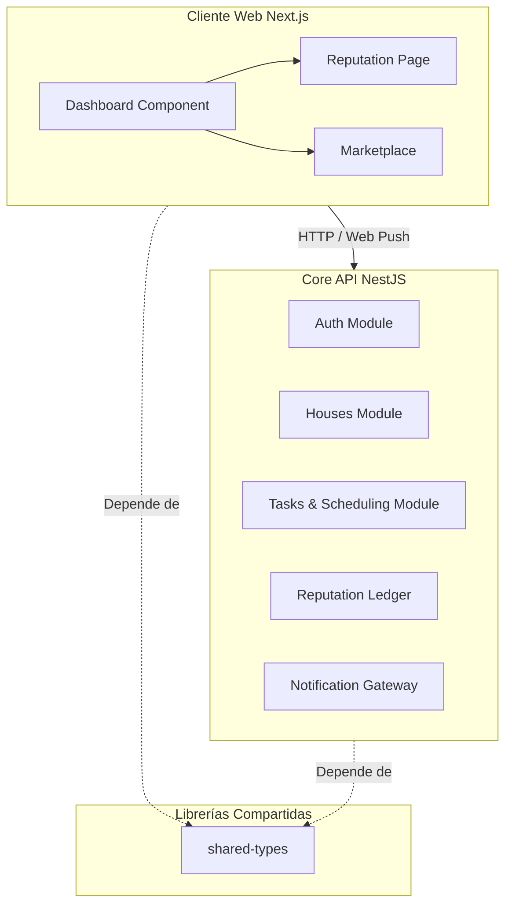

# Kimito — El Pasaporte de Coexistencia y Roommates

[](https://www.typescriptlang.org/)
[](https://nextjs.org/)
[](https://nestjs.com/)
[](https://tailwindcss.com/)
[](https://www.prisma.io/)
[](https://aws.amazon.com/)

> **Kimito** transforma la vida compartida sustituyendo los conflictos cotidianos por un registro de reputación algorítmico y basado en evidencias. Actúa como un "Pasaporte de Coexistencia" descentralizado para inquilinos modernos, combinando una distribución equitativa de tareas con un marketplace premium de roommates.

---

```
                                  [ K I M I T O ]
                     Infraestructura de Confianza para Co-Living
                                  
+---------------------------------------------------------------------------------+
|                                                                                 |
|  [PLACEHOLDER: Imagen Destacada - Mockups profesionales mostrando el Dashboard  |
|   de Kimito junto al Pasaporte de Reputación en un dispositivo móvil]           |
|                                                                                 |
+---------------------------------------------------------------------------------+
```

---

## El Producto

Compartir vivienda presenta retos organizacionales complejos. Un alto porcentaje de los conflictos entre roommates surge por la desigualdad en la limpieza y la falta de rendición de cuentas. Kimito resuelve esto mediante un registro de rendimiento del hogar transparente y estructurado.

### Propuestas de Valor Clave
*   **Equidad Algorítmica (Scheduling):** Las tareas se asignan semanalmente de forma automática según su peso estimado (dificultad y tiempo). El algoritmo greedy de empaquetado de contenedores (greedy bin-packing) garantiza que ningún roommate cargue con una responsabilidad desproporcionada.
*   **El Pasaporte de Coexistencia (reputación de 0.0 a 5.0):** Cada tarea completada a tiempo mejora la puntuación pública. Al mudarse a un nuevo hogar, el usuario puede exportar su Pasaporte de Coexistencia verificado para demostrar que es un inquilino ejemplar.
*   **Registro de Evidencias (S3):** Los miembros del hogar suben evidencia fotográfica al completar tareas, con respaldo en Amazon S3, manteniendo la transparencia sin necesidad de supervisión manual.
*   **Marketplace de Roommates:** Un portal de búsqueda especializado para publicar habitaciones disponibles o postularse a hogares compartidos basándose en la reputación verificada de los usuarios.
*   **Notificaciones Instantáneas:** Alertas directas en el navegador mediante Web Push nativo para informar sobre nuevas tareas asignadas o completadas, sin depender de servicios de terceros.

---

## Arquitectura y Estructura del Monorepo

Kimito se estructura en un monorepo altamente optimizado gestionado con Turborepo y pnpm.



### Distribución de Directorios
```
├── apps/
│   ├── web/          # Frontend Next.js (Desplegado en Vercel)
│   │                 # App Router, componentes de shadcn/ui, autenticación con Auth.js
│   └── api/          # Backend API NestJS (Desplegado en AWS Elastic Beanstalk)
│                     # Modular por funcionalidad: auth, houses, tasks, scheduling, reputation, listings
├── packages/
│   ├── shared-types/ # Tipos e interfaces de TypeScript compartidos
│   └── infra/        # Infraestructura como Código (IaC)
│       └── terraform/# Manifiestos de Terraform (RDS, S3, IAM, Elastic Beanstalk)
└── pnpm-workspace.yaml
```

---

## Primeros Pasos

Siga las siguientes instrucciones para configurar y ejecutar el entorno de desarrollo local.

### Requisitos Previos
*   **Node.js** v20.x o superior
*   **pnpm** v10.x o superior (`npm install -g pnpm`)
*   **Docker & Docker Compose** (para la base de datos PostgreSQL local)

---

### Proceso de Instalación

#### 1. Clonar el repositorio e instalar dependencias
Ejecute el siguiente comando en la raíz del proyecto para descargar las dependencias y vincular los paquetes locales:
```bash
pnpm install
```

#### 2. Configurar variables de entorno
Copie las plantillas de configuración de entorno en ambas aplicaciones:
```bash
cp apps/api/.env.example apps/api/.env
cp apps/web/.env.example apps/web/.env
```

Asegúrese de configurar adecuadamente las variables correspondientes en los archivos `apps/api/.env` y `apps/web/.env` (claves de JWT, credenciales de base de datos y llaves VAPID).

#### 3. Iniciar la base de datos local
Levante el contenedor de PostgreSQL en segundo plano:
```bash
docker compose up -d
```

#### 4. Sincronizar el esquema de la base de datos
Aplique los esquemas de Prisma a la base de datos PostgreSQL local:
```bash
pnpm --filter api exec prisma db push
```

#### 5. Ejecutar los servicios en modo de desarrollo
Inicie el entorno de desarrollo concurrente con Turborepo:
```bash
pnpm dev
```

*   **API Service:** `http://localhost:3000`
*   **Frontend Service:** `http://localhost:3001`

---

## Compilación y Despliegue en Producción

### Compilación General
Valide tipados, esquemas y empaquetado del monorepo con el siguiente comando:
```bash
pnpm build
```

### Integración con Docker (NestJS Backend)
El servicio backend (`apps/api`) utiliza una construcción Docker multi-stage para garantizar ligereza:
1.  **Etapa de Construcción (builder):** Instala el entorno completo del monorepo para compilar el backend haciendo uso del paquete `packages/shared-types`, genera el cliente de Prisma y compila el código a JavaScript puro en el directorio `dist/`.
2.  **Etapa de Ejecución (runner):** Copia únicamente el directorio `dist/` compilado y las dependencias de producción, reduciendo el tamaño final de la imagen y garantizando mayor seguridad en el despliegue.

---

## Infraestructura en la Nube (AWS e IaC)

Kimito se despliega de forma simplificada en Amazon Web Services (AWS) para evitar sobre-ingeniería:
*   **Aplicación Backend:** API de NestJS alojada en AWS Elastic Beanstalk (mediante Docker).
*   **Base de Datos:** PostgreSQL en Amazon RDS, configurado dentro de un grupo de seguridad que restringe el acceso únicamente al grupo de seguridad de Elastic Beanstalk.
*   **Almacenamiento:** Amazon S3 para avatares de usuario, imágenes de marketplace y evidencias fotográficas de limpieza.
*   **IaC:** Archivos de configuración de Terraform ubicados en `packages/infra/terraform/` para aprovisionar los recursos de forma automatizada con estado local.

---


