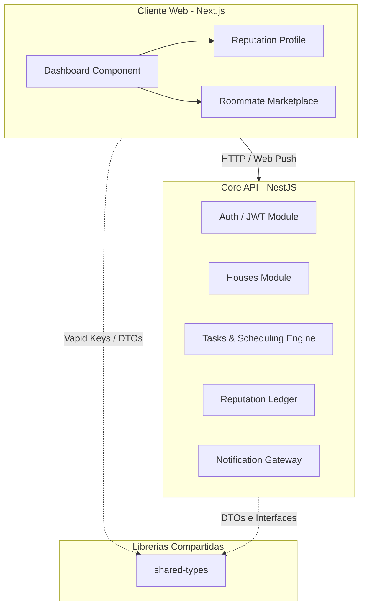

[](https://kimito-peach.vercel.app)

<h1 align="center">Kimito — Plataforma de Confianza para Co-Living</h1>

<p align="center">
  <strong>Pasaporte de coexistencia y marketplace verificado para gestionar hogares compartidos de manera equitativa y transparente.</strong>
</p>

<p align="center">
  <a href="https://www.typescriptlang.org/"></a>
  <a href="https://nextjs.org/"></a>
  <a href="https://nestjs.com/"></a>
  <a href="https://tailwindcss.com/"></a>
  <a href="https://www.prisma.io/"></a>
  <a href="https://aws.amazon.com/"></a>
</p>

<p align="center">
  Next.js (App Router) + NestJS + Prisma ORM + AWS (S3, RDS, Beanstalk) + Web Push (VAPID)
</p>

---

## Introduccion

Kimito resuelve las fricciones organizacionales y los conflictos de convivencia en hogares compartidos. La plataforma reemplaza las discusiones cotidianas por un registro de rendimiento transparente basado en evidencias. Ofrece un sistema de reparto equitativo de tareas, un historial de reputación verificable que funciona como pasaporte de inquilino (MembershipHistory) y un marketplace para publicar y postular a habitaciones disponibles.

---

## Funcionalidades Core

### 1. Gestión de Casas y Coexistencia
* **Registro de Hogares:** Los administradores pueden crear y configurar un hogar especificando dirección física, reglas internas, servicios incluidos y descripción general.
* **Onboarding Semiespejado:** Unirse a una casa existente mediante un código único o enlaces parametrizados. Integración con la Web Share API para invitar a futuros habitantes a través de WhatsApp, Telegram o redes sociales.
* **Gestión de Miembros:** Panel de control para visualizar el estado de cada habitante, administrar roles (administrador/miembro) y monitorear la actividad del hogar en tiempo real.

### 2. Algoritmo de Reparto Equitativo (Workload Scheduling)
* **Ponderación por Dificultad (Task Weight):** Las tareas domésticas no se tratan por igual. Cada labor tiene asignado un peso numérico basado en la complejidad, tiempo estimado de ejecución y esfuerzo físico requerido.
* **Distribución por Greedy Bin-Packing:** Algoritmo de optimización que analiza la suma total del peso de las tareas activas y las distribuye entre los miembros del hogar, minimizando la varianza para lograr una carga de trabajo matemáticamente justa e imparcial.
* **Ciclo de Vida Automático (Cron Jobs):** Ejecución automatizada del reparto semanal (programada para cada lunes a primera hora) con capacidad de reinicio manual o reasignación adaptativa si un miembro sale del hogar.
* **Verificación con Evidencia Fotográfica (Proof-of-Clean):** Para marcar una tarea como completada, el usuario debe subir una fotografía en tiempo real como evidencia, almacenada de forma segura en Amazon S3. Los demás habitantes pueden inspeccionar la evidencia para validar la ejecución.

### 3. Pasaporte de Coexistencia (Sistema de Reputación)
* **Score Dinámico (0.0 a 5.0 Estrellas):** Métrica de desempeño calculada automáticamente. Suma puntos según el peso de las tareas completadas a tiempo y penaliza los incumplimientos o retrasos en las entregas.
* **Historial Inmutable de Convivencia (`MembershipHistory`):** Registro auditable de la trayectoria del usuario en hogares anteriores. Almacena períodos de estancia, roles desempeñados y el nivel de cumplimiento acumulado.
* **Identidad Verificada para Arrendadores:** El Pasaporte de Coexistencia actúa como una carta de presentación basada en datos reales, eliminando la incertidumbre al evaluar la responsabilidad de un potencial habitante.

### 4. Marketplace de Habitaciones y Roommates
* **Publicación de Vacantes:** Módulo para publicar habitaciones disponibles incluyendo canon mensual, depósito de garantía, servicios compartidos, políticas de la casa (mascotas, fumadores, género) y galería fotográfica.
* **Motor de Búsqueda y Filtros Avanzados:** Filtrado granular por rango de precio, ubicación geográfica, preferencias de estilo de vida y calificación mínima de reputación.
* **Transparencia en Ambos Sentidos:**
  * **Para el aspirante:** Visualiza el score de reputación promedio de la casa y el perfil de los actuales habitantes antes de solicitar la habitación.
  * **Para el anfitrión/arrendador:** Revisa el Pasaporte de Coexistencia y el score individual del postulante antes de aceptar la solicitud.
* **Postulación y Contacto Directo:** Sistema de solicitudes integrado con notificaciones push en tiempo real y enlace directo a WhatsApp (`wa.me`) para agilizar la comunicación y el cierre del acuerdo.

## Arquitectura del Sistema

El proyecto está diseñado bajo un esquema de Monorepo administrado con Turborepo y pnpm para optimizar la compilación y el intercambio de tipos de TypeScript.



### Organizacion del Codigo
*   `apps/web/`: Aplicación frontend construida en Next.js (App Router) y componentes estilizados con Tailwind CSS y shadcn/ui.
*   `apps/api/`: Backend estructurado en NestJS organizado **por feature** (autocontenido: controller, service, dto y módulo en cada carpeta).
*   `packages/shared-types/`: DTOs, enums e interfaces compartidas entre frontend y backend para mantener consistencia de tipado en tiempo de compilación.
*   `packages/infra/`: Manifiestos de infraestructura como código (Terraform) y Dockerfiles.

---

## Plan de Despliegue e Infraestructura

El aprovisionamiento de recursos se gestiona como código (IaC) mediante archivos de configuración de Terraform en `packages/infra/terraform/` utilizando recursos mínimos para optimizar costos y tiempos.

### 1. Frontend
*   **Plataforma:** Desplegado en Vercel.
*   **Integracion:** Conectado directamente al repositorio para despliegues automáticos basados en ramas (CI/CD).

### 2. Backend (API)
*   **Plataforma:** AWS Elastic Beanstalk (Docker Platform).
*   **Empaquetado:** El backend se encapsula en una imagen Docker usando un proceso de construcción multi-etapa (multi-stage build) para minimizar el tamaño final de la imagen.

### 3. Base de Datos
*   **Plataforma:** Amazon RDS (PostgreSQL).
*   **Seguridad:** Restringida para evitar el acceso público irrestricto. El Security Group de RDS está configurado para aceptar tráfico entrante exclusivamente desde el Security Group asignado a la instancia de AWS Elastic Beanstalk.

### 4. Almacenamiento de Evidencias
*   **Plataforma:** Amazon S3.
*   **Uso:** Almacenamiento de avatares, fotos de marketplace y las evidencias fotográficas obligatorias enviadas por los usuarios al marcar tareas como completadas.

### 5. Notificaciones de Eventos
*   **Protocolo:** Web Push nativo (VAPID).
*   **Uso:** Envío directo al navegador de notificaciones en tiempo real al asignar tareas, completar labores, unirse nuevos miembros o postularse roommates, sin dependencias de servicios externos (Firebase/OneSignal).

---

## Primeros Pasos

### Requisitos locales
*   Node.js v20 o superior
*   pnpm v10 o superior
*   Docker y Docker Compose

### Instalacion y Ejecucion

1. **Instalar dependencias:**
   ```bash
   pnpm install
   ```

2. **Configurar entorno:**
   ```bash
   cp apps/api/.env.example apps/api/.env
   cp apps/web/.env.example apps/web/.env
   ```

3. **Levantar base de datos local:**
   ```bash
   docker compose up -d
   ```

4. **Sincronizar base de datos:**
   ```bash
   pnpm --filter api exec prisma db push
   ```

5. **Iniciar desarrollo:**
   ```bash
   pnpm dev
   ```

---

## Integrantes del Equipo

*   Emilio Escobedo 
*   Herson Urdiales
*   Alberto Gutierrez

---

## Capturas de Pantalla

### Dashboard y Gestion de Tareas
<p align="center">
  
  
  
</p>

### Hogar Compartido y Ubicaciones
<p align="center">
  
  
  
</p>

### Marketplace y Reputacion
<p align="center">
  
  
</p>

<p align="center">
  
  
</p>
