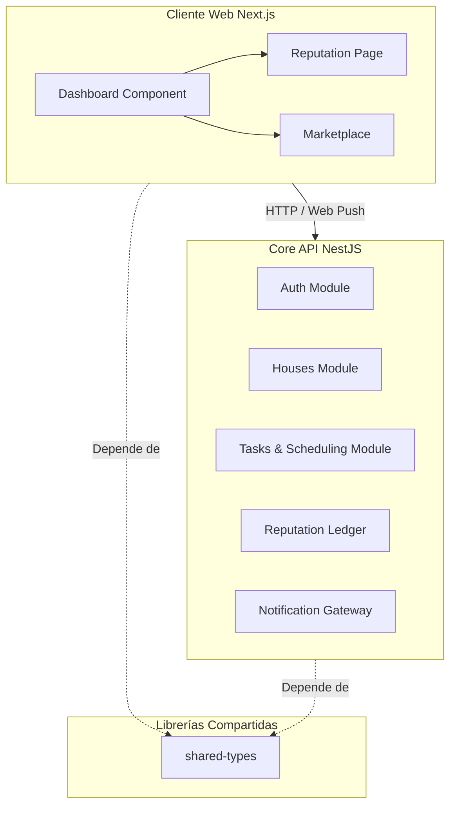

<p align="center">
  
</p>

<h1 align="center">✨ Kimito — La Infraestructura de Confianza para Co-Living ✨</h1>

<p align="center">
  <strong>El primer pasaporte de coexistencia y marketplace verificado para un hogar compartido sin fricciones.</strong>
</p>

<p align="center">
  <a href="https://www.typescriptlang.org/"></a>
  <a href="https://nextjs.org/"></a>
  <a href="https://nestjs.com/"></a>
  <a href="https://tailwindcss.com/"></a>
  <a href="https://www.prisma.io/"></a>
  <a href="https://aws.amazon.com/"></a>
</p>

<p align="center">
  Next.js (App Router) + NestJS + Prisma ORM + AWS (S3, RDS, Beanstalk) + Web Push (VAPID)
</p>

---

## 💡 El Producto & Funcionalidades

Compartir vivienda presenta retos organizacionales complejos. Un alto porcentaje de los conflictos entre roommates surge por la desigualdad en la limpieza y la falta de rendición de cuentas. Kimito resuelve esto mediante un registro de rendimiento del hogar transparente y estructurado.

A continuación, se presenta el flujo completo de funcionalidades en orden secuencial del producto:

### 🏠 1. Gestión de Hogares y Coexistencia
*   **Crear un Hogar Compartido:** Registra un nuevo hogar con su nombre, descripción, reglas y dirección física.
*   **Código de Invitación Directo y Enlaces Sociales:** Invita roommates compartiendo el código manual o mediante enlaces de invitación directa de WhatsApp, Telegram o Facebook, con soporte para Web Share API en móviles.
*   **Unirse a un Hogar:** Ingresa el código o accede a través del link de invitación para unirte instantáneamente.

### 📅 2. Organización y Equidad en Tareas
*   **Catálogo de Tareas con Peso:** Asigna dificultades relativas a cada tarea de aseo.
*   **Algoritmo de Asignación Equitativa:** Distribuye las labores domésticas semanalmente de forma equitativa utilizando un algoritmo codicioso de empaquetado (greedy bin-packing).
*   **Evidencias con Fotografía:** Carga fotos de las tareas terminadas almacenándolas de forma segura en Amazon S3.

### 🏆 3. Pasaporte de Coexistencia (Reputación)
*   **Score Dinámico de Reputación:** Calificación en tiempo real de 0.0 a 5.0 estrellas según el cumplimiento de tareas domésticas.
*   **Currículum Permanente de Roommate:** Al mudarte o disolver un hogar, tu rol y reputación quedan registrados en tu historial de convivencia (`MembershipHistory`), sirviendo como tu "carta de presentación" para futuras casas.

### 🛡️ 4. Administración y Seguridad
*   **Expulsión de Miembros (Admin):** Los administradores pueden remover miembros que no cumplan las reglas.
*   **Disolución de Hogar (Admin):** Elimina de forma segura la casa y todos sus datos relacionados.
*   **Salida Voluntaria:** Los inquilinos pueden retirarse de un hogar cuando lo decidan resguardando su reputación.

### 🗺️ 5. Integración de Mapas y Direcciones
*   **Buscador Inteligente de Direcciones:** Autocompletado en tiempo real con debounce integrado a través de OpenStreetMap (Nominatim API).
*   **Mapas Interactivos:** Embebidos de Google Maps integrados en Marketplace y vistas del hogar.

### 🔑 6. Marketplace de Roommates y Postulaciones
*   **Publicar Habitación Disponible:** Anuncia cuartos especificando precio, depósito, fotos descriptivas y preferencias del hogar.
*   **Filtros Avanzados Premium:** Segmentación interactiva por precio, género preferido, mascotas y fumadores.
*   **Postulaciones y Contacto Rápido:** Postúlate ingresando tu contacto y envía mensajes directos de WhatsApp (`wa.me`) con un solo clic.

---

## 🛠️ Arquitectura y Estructura del Monorepo

Kimito se estructura en un monorepo altamente optimizado gestionado con Turborepo y pnpm.



### Distribución de Directorios
```
├── apps/
│   ├── web/          # Frontend Next.js (Desplegado en Vercel)
│   │                 # App Router, componentes de shadcn/ui, autenticación con Auth.js
│   └── api/          # Backend API NestJS (Desplegado en AWS Elastic Beanstalk)
│                     # Modular por funcionalidad: auth, houses, tasks, scheduling, reputation, listings
├── packages/
│   ├── shared-types/ # Tipos e interfaces de TypeScript compartidos
│   └── infra/        # Infraestructura como Código (IaC)
│       └── terraform/# Manifiestos de Terraform (RDS, S3, IAM, Elastic Beanstalk)
└── pnpm-workspace.yaml
```

---

## 🚀 Primeros Pasos

### Requisitos Previos
*   **Node.js** v20.x o superior
*   **pnpm** v10.x o superior (`npm install -g pnpm`)
*   **Docker & Docker Compose** (para PostgreSQL local)

### Proceso de Instalación

1. **Instalar dependencias locales:**
   ```bash
   pnpm install
   ```

2. **Configurar variables de entorno:**
   ```bash
   cp apps/api/.env.example apps/api/.env
   cp apps/web/.env.example apps/web/.env
   ```

3. **Iniciar base de datos PostgreSQL local:**
   ```bash
   docker compose up -d
   ```

4. **Sincronizar esquema de Prisma:**
   ```bash
   pnpm --filter api exec prisma db push
   ```

5. **Iniciar modo de desarrollo:**
   ```bash
   pnpm dev
   ```
   - Backend (NestJS): `http://localhost:3000`
   - Frontend (Next.js): `http://localhost:3001`

---

## 🐳 Docker

### Desarrollo (PostgreSQL)
```bash
docker compose up -d        # Levantar
docker compose down         # Detener
docker compose down -v      # Detener y limpiar volumen
```

### Producción (API)
```bash
docker build -t kimito-api -f apps/api/Dockerfile .
docker run -p 3000:3000 --env-file apps/api/.env kimito-api
```

---

## 📊 Endpoints del Marketplace

| Método | Ruta | Descripción |
|--------|------|-------------|
| `POST` | `/listings` | Crear publicación de habitación (Auth requerida) |
| `GET` | `/listings` | Listar publicaciones con filtros y paginación |
| `GET` | `/listings/:id` | Obtener una publicación |
| `PATCH` | `/listings/:id` | Editar publicación (solo dueño) |
| `DELETE` | `/listings/:id` | Eliminar publicación (solo dueño) |

---

## 👥 Integrantes

<p align="center">
  <strong>Emilio Escobedo (PatoCrazy2)</strong> &nbsp;•&nbsp; <strong>Herson Urdiales</strong>
</p>

---

## 📸 Galería y Capturas de Pantalla

<h3 align="center">Dashboard & Tareas</h3>
<p align="center">
  
  
  
</p>

<h3 align="center">Mi Casa & Ubicaciones</h3>
<p align="center">
  
  
  
</p>

<h3 align="center">Marketplace de Roommates</h3>
<p align="center">
  
  
</p>

<h3 align="center">Perfil & Onboarding</h3>
<p align="center">
  
  
</p>
