<p align="center">
  <a href="https://kimito-peach.vercel.app">
    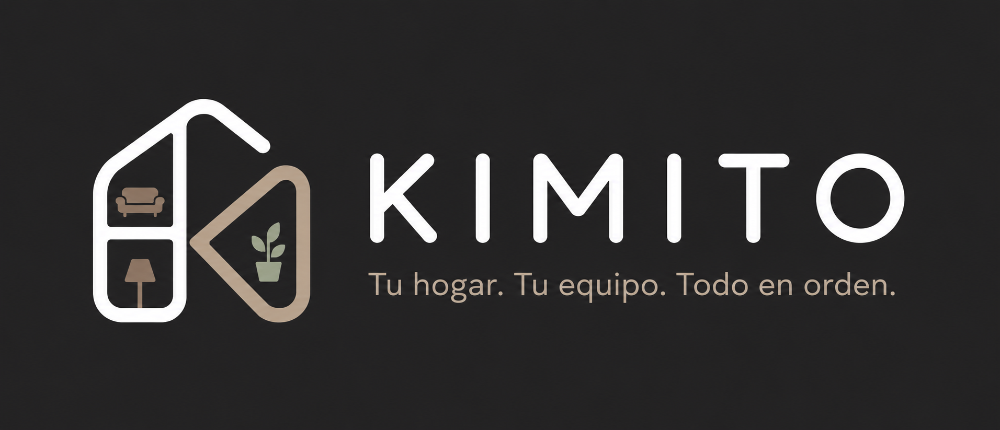
  </a>
</p>

<h1 align="center">Kimito — Plataforma de Confianza para Co-Living</h1>

<p align="center">
  <strong>Pasaporte de coexistencia y marketplace verificado para gestionar hogares compartidos de manera equitativa y transparente.</strong>
</p>

<p align="center">
  <a href="https://www.typescriptlang.org/"></a>
  <a href="https://nextjs.org/"></a>
  <a href="https://nestjs.com/"></a>
  <a href="https://tailwindcss.com/"></a>
  <a href="https://www.prisma.io/"></a>
  <a href="https://aws.amazon.com/"></a>
</p>

<p align="center">
  Next.js (App Router) + NestJS + Prisma ORM + AWS (S3, RDS, Beanstalk) + Web Push (VAPID)
</p>

---

## Introduccion

Kimito resuelve las fricciones organizacionales y los conflictos de convivencia en hogares compartidos. La plataforma reemplaza las discusiones cotidianas por un registro de rendimiento transparente basado en evidencias. Ofrece un sistema de reparto equitativo de tareas, un historial de reputación verificable que funciona como pasaporte de inquilino (MembershipHistory) y un marketplace para publicar y postular a habitaciones disponibles.

---

## Funcionalidades Core

### 1. Gestion de Casas y Coexistencia
*   **Creacion de Hogares:** Los usuarios administradores pueden registrar una casa, definiendo reglas, descripción y dirección física.
*   **Invitacion Directa y Social:** Envío de invitaciones mediante un código manual o enlaces parametrizados a WhatsApp, Telegram y Facebook, integrando Web Share API.
*   **Unidad Colectiva:** Los miembros se unen al instante para sincronizar las actividades cotidianas del hogar.

### 2. Algoritmo de Reparto Equitativo (Scheduling)
*   **Peso de Tareas:** Cada tarea tiene asignado un peso numérico que representa su nivel de dificultad y duración estimada.
*   **Distribucion Optimizada:** Para balancear la carga de trabajo, Kimito implementa un algoritmo codicioso de empaquetado (greedy bin-packing) que balancea el peso acumulado asignado a cada roommate de la manera más cercana posible al promedio equitativo del hogar.
*   **Ejecucion Automatizada y Manual:** Un cron job ejecuta el reparto de forma automática cada lunes por la madrugada, con endpoints habilitados para reasignaciones o disparadores manuales.
*   **Evidencia Fotografica:** Al terminar una tarea, el usuario debe subir una foto de evidencia que se almacena directamente en Amazon S3.

### 3. Pasaporte de Coexistencia (Reputacion)
*   **Score en Tiempo Real:** Calificación dinámica de 0.0 a 5.0 estrellas calculada con base en el cumplimiento de tareas domésticas asignadas.
*   **Curriculum de Convivencia:** Historial inmutable (`MembershipHistory`) que almacena el rol, período y comportamiento en casas anteriores. Sirve como carta de presentación verificada para postularse a nuevos hogares compartidos.

### 4. Marketplace de Roommates
*   **Anuncios de Habitaciones:** Publicaciones con detalles de precio mensual, depósito requerido, género preferido y fotos de la vivienda.
*   **Filtros Avanzados:** Búsqueda parametrizada por ubicación, rango de precio, mascotas y fumadores.
*   **Postulaciones y Enlace Directo:** Los candidatos pueden postularse y el anunciante puede contactar al aspirante de forma inmediata vía WhatsApp (`wa.me`) o invitarlo a unirse formalmente mediante notificaciones push.

---

## Arquitectura del Sistema

El proyecto está diseñado bajo un esquema de Monorepo administrado con Turborepo y pnpm para optimizar la compilación y el intercambio de tipos de TypeScript.

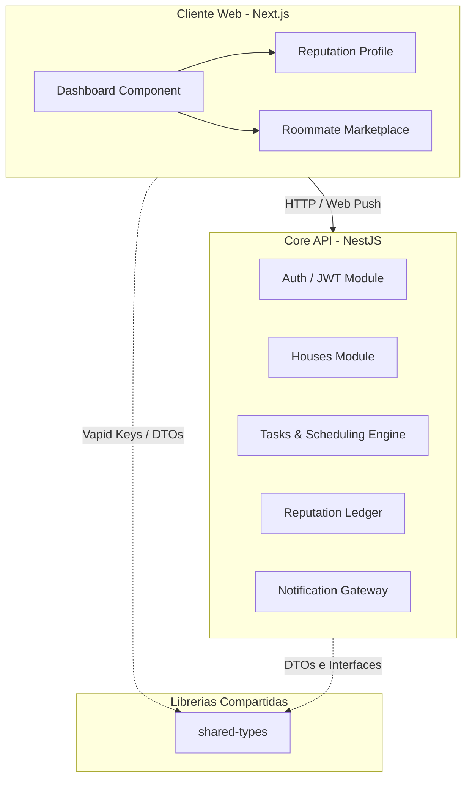

### Organizacion del Codigo
*   `apps/web/`: Aplicación frontend construida en Next.js (App Router) y componentes estilizados con Tailwind CSS y shadcn/ui.
*   `apps/api/`: Backend estructurado en NestJS organizado **por feature** (autocontenido: controller, service, dto y módulo en cada carpeta).
*   `packages/shared-types/`: DTOs, enums e interfaces compartidas entre frontend y backend para mantener consistencia de tipado en tiempo de compilación.
*   `packages/infra/`: Manifiestos de infraestructura como código (Terraform) y Dockerfiles.

---

## Plan de Despliegue e Infraestructura

El aprovisionamiento de recursos se gestiona como código (IaC) mediante archivos de configuración de Terraform en `packages/infra/terraform/` utilizando recursos mínimos para optimizar costos y tiempos.

### 1. Frontend
*   **Plataforma:** Desplegado en Vercel.
*   **Integracion:** Conectado directamente al repositorio para despliegues automáticos basados en ramas (CI/CD).

### 2. Backend (API)
*   **Plataforma:** AWS Elastic Beanstalk (Docker Platform).
*   **Empaquetado:** El backend se encapsula en una imagen Docker usando un proceso de construcción multi-etapa (multi-stage build) para minimizar el tamaño final de la imagen.

### 3. Base de Datos
*   **Plataforma:** Amazon RDS (PostgreSQL).
*   **Seguridad:** Restringida para evitar el acceso público irrestricto. El Security Group de RDS está configurado para aceptar tráfico entrante exclusivamente desde el Security Group asignado a la instancia de AWS Elastic Beanstalk.

### 4. Almacenamiento de Evidencias
*   **Plataforma:** Amazon S3.
*   **Uso:** Almacenamiento de avatares, fotos de marketplace y las evidencias fotográficas obligatorias enviadas por los usuarios al marcar tareas como completadas.

### 5. Notificaciones de Eventos
*   **Protocolo:** Web Push nativo (VAPID).
*   **Uso:** Envío directo al navegador de notificaciones en tiempo real al asignar tareas, completar labores, unirse nuevos miembros o postularse roommates, sin dependencias de servicios externos (Firebase/OneSignal).

---

## Primeros Pasos

### Requisitos locales
*   Node.js v20 o superior
*   pnpm v10 o superior
*   Docker y Docker Compose

### Instalacion y Ejecucion

1. **Instalar dependencias:**
   ```bash
   pnpm install
   ```

2. **Configurar entorno:**
   ```bash
   cp apps/api/.env.example apps/api/.env
   cp apps/web/.env.example apps/web/.env
   ```

3. **Levantar base de datos local:**
   ```bash
   docker compose up -d
   ```

4. **Sincronizar base de datos:**
   ```bash
   pnpm --filter api exec prisma db push
   ```

5. **Iniciar desarrollo:**
   ```bash
   pnpm dev
   ```

---

## Integrantes del Equipo

*   Emilio Escobedo (PatoCrazy2)
*   Herson Urdiales

---

## Capturas de Pantalla

### Dashboard y Gestion de Tareas
<p align="center">
  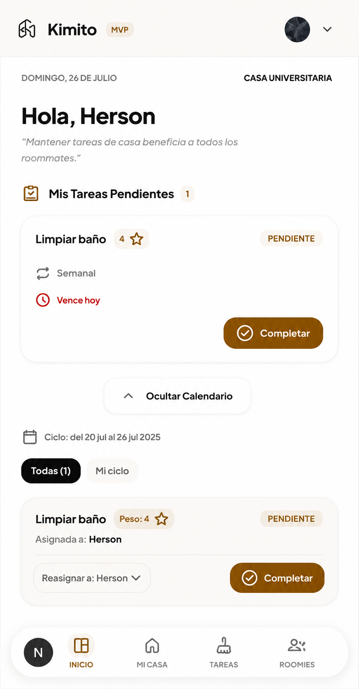
  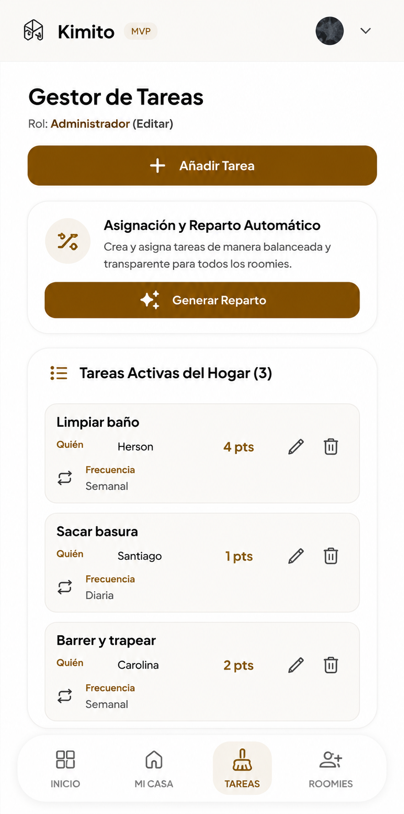
  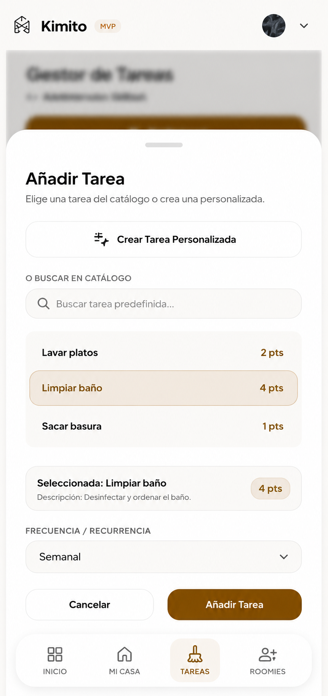
</p>

### Hogar Compartido y Ubicaciones
<p align="center">
  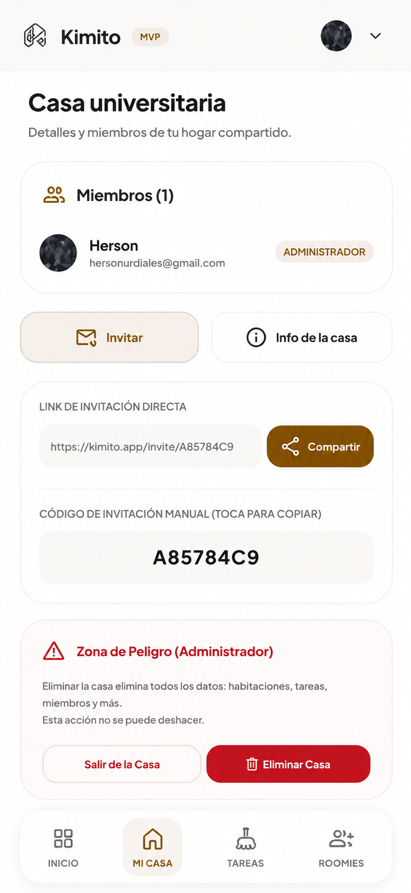
  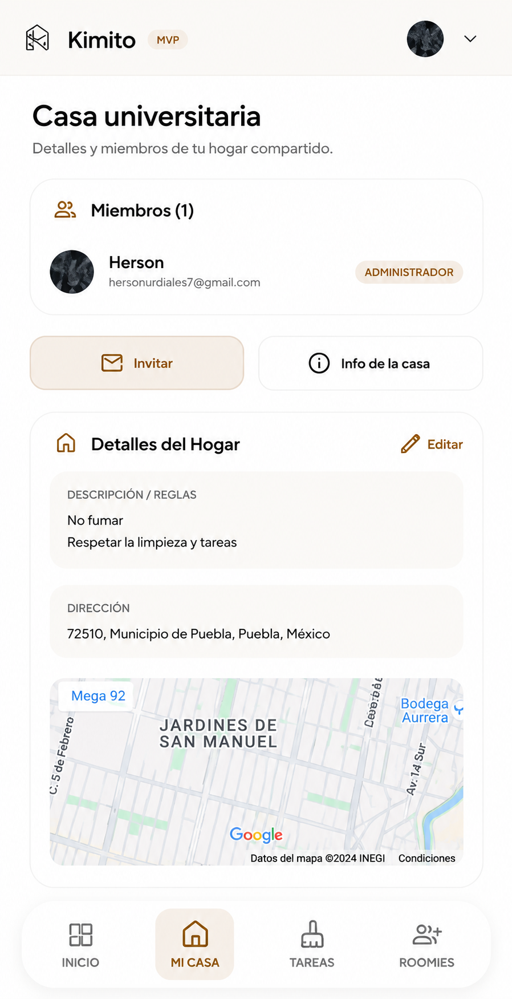
  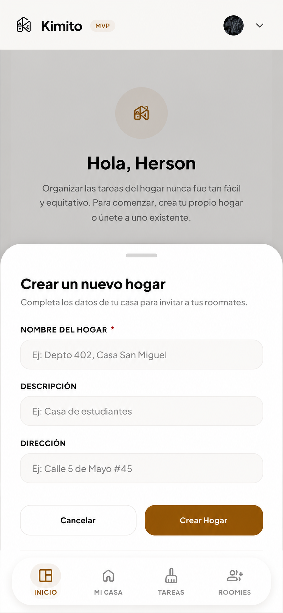
</p>

### Marketplace y Reputacion
<p align="center">
  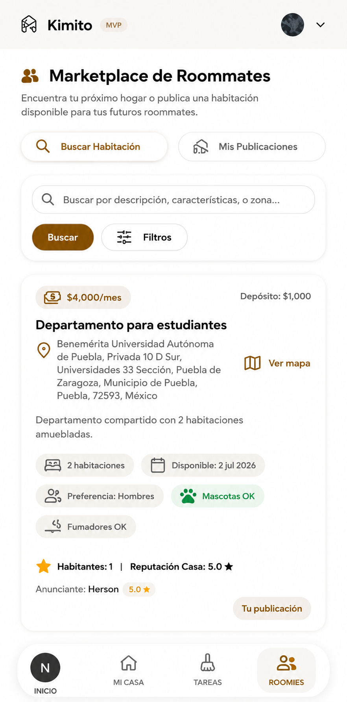
  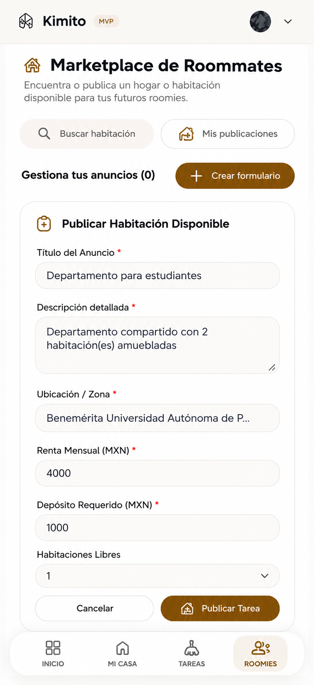
</p>

<p align="center">
  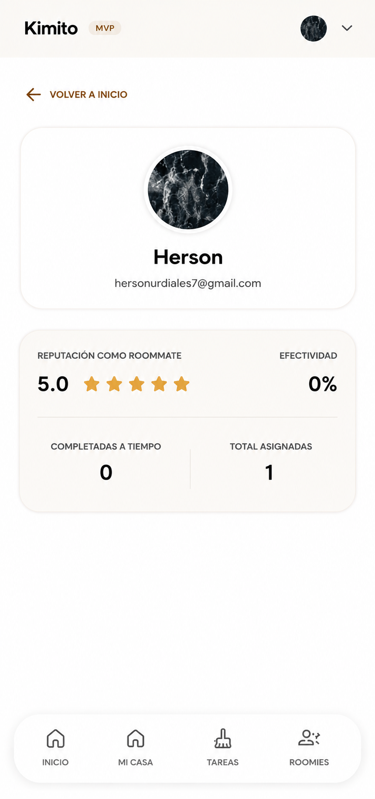
  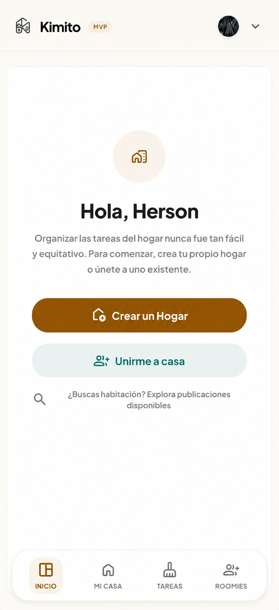
</p>
