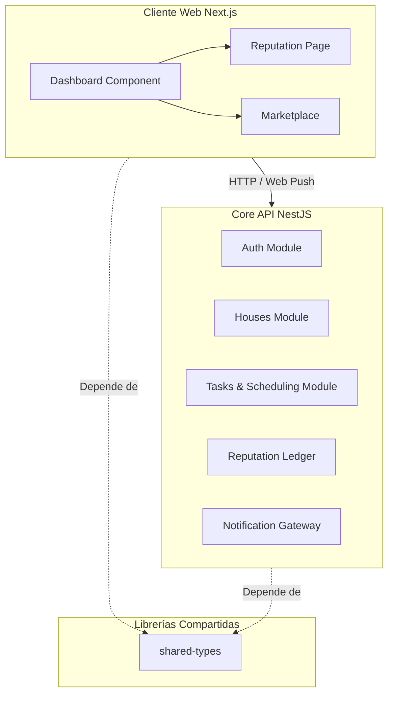

# Kimito — El Pasaporte de Coexistencia y Roommates

[](https://www.typescriptlang.org/)
[](https://nextjs.org/)
[](https://nestjs.com/)
[](https://www.prisma.io/)
[](https://aws.amazon.com/)

> **Kimito** transforma la vida compartida sustituyendo los conflictos cotidianos por un registro de reputación algorítmico y basado en evidencias. Actúa como un "Pasaporte de Coexistencia" descentralizado para inquilinos modernos, combinando una distribución equitativa de tareas con un marketplace premium de roommates.

---

```
                                  [ K I M I T O ]
                     Infraestructura de Confianza para Co-Living
                                  
 +---------------------------------------------------------------------------------+
 |                                                                                 |
 |  [PLACEHOLDER: Imagen Destacada - Mockups profesionales mostrando el Dashboard  |
 |   de Kimito junto al Pasaporte de Reputación en un dispositivo móvil]           |
 |                                                                                 |
 +---------------------------------------------------------------------------------+
```

---

## El Producto

Compartir vivienda presenta retos organizacionales complejos. Un alto porcentaje de los conflictos entre roommates surge por la desigualdad en la limpieza y la falta de rendición de cuentas. Kimito resuelve esto mediante un registro de rendimiento del hogar transparente y estructurado.

### Propuestas de Valor Clave
*   **Equidad Algorítmica (Scheduling):** Las tareas se asignan semanalmente de forma automática según su peso estimado (dificultad y tiempo). El algoritmo greedy de empaquetado de contenedores (greedy bin-packing) garantiza que ningún roommate cargue con una responsabilidad desproporcionada.
*   **El Pasaporte de Coexistencia (reputación de 0.0 a 5.0):** Cada tarea completada a tiempo mejora la puntuación pública. Al mudarse a un nuevo hogar, el usuario puede exportar su Pasaporte de Coexistencia verificado para demostrar que es un inquilino ejemplar.
*   **Registro de Evidencias (S3):** Los miembros del hogar suben evidencia fotográfica al completar tareas, con respaldo en Amazon S3, manteniendo la transparencia sin necesidad de supervisión manual.
*   **Marketplace de Roommates:** Un portal de búsqueda especializado para publicar habitaciones disponibles o postularse a hogares compartidos basándose en la reputación verificada de los usuarios.
*   **Notificaciones Instantáneas:** Alertas directas en el navegador mediante Web Push nativo para informar sobre nuevas tareas asignadas o completadas, sin depender de servicios de terceros.

---

## Arquitectura y Estructura del Monorepo

Kimito se estructura en un monorepo altamente optimizado gestionado con Turborepo y pnpm.



### Distribución de Directorios
```
├── apps/
│   ├── web/          # Frontend Next.js (Desplegado en Vercel)
│   │                 # App Router, componentes de shadcn/ui, autenticación con Auth.js
│   └── api/          # Backend API NestJS (Desplegado en AWS Elastic Beanstalk)
│                     # Modular por funcionalidad: auth, houses, tasks, scheduling, reputation, listings
├── packages/
│   ├── shared-types/ # Tipos e interfaces de TypeScript compartidos
│   └── infra/        # Infraestructura como Código (IaC)
│       └── terraform/# Manifiestos de Terraform (RDS, S3, IAM, Elastic Beanstalk)
└── pnpm-workspace.yaml
```

---

## Primeros Pasos

Siga las siguientes instrucciones para configurar y ejecutar el entorno de desarrollo local.

### Requisitos Previos
*   **Node.js** v20.x o superior
*   **pnpm** v10.x o superior (`npm install -g pnpm`)
*   **Docker & Docker Compose** (para la base de datos PostgreSQL local)

---

### Proceso de Instalación

#### 1. Clonar el repositorio e instalar dependencias
Ejecute el siguiente comando en la raíz del proyecto para descargar las dependencias y vincular los paquetes locales:
```bash
pnpm install
```

#### 2. Configurar variables de entorno
Copie las plantillas de configuración de entorno en ambas aplicaciones:
```bash
cp apps/api/.env.example apps/api/.env
cp apps/web/.env.example apps/web/.env
```

Asegúrese de configurar adecuadamente las variables correspondientes en los archivos `apps/api/.env` and `apps/web/.env` (claves de JWT, credenciales de base de datos y llaves VAPID).

#### 3. Iniciar la base de datos local
Levante el contenedor de PostgreSQL en segundo plano:
```bash
docker compose up -d
```

#### 4. Sincronizar el esquema de la base de datos
Aplique los esquemas de Prisma a la base de datos PostgreSQL local:
```bash
pnpm --filter api exec prisma db push
```

#### 5. Ejecutar los servicios en modo de desarrollo
Inicie el entorno de desarrollo concurrente con Turborepo:
```bash
pnpm dev
```

Esto inicia:
- **Backend (NestJS):** `http://localhost:3000`
- **Frontend (Next.js):** `http://localhost:3001`

---

## Variables de Entorno

### Backend (`apps/api/.env`)

| Variable | Descripción |
|----------|-------------|
| `DATABASE_URL` | Connection string PostgreSQL |
| `AUTH_SECRET` | Secret compartido con frontend para JWT (mínimo 32 chars) |
| `GOOGLE_CLIENT_ID` | OAuth Google (opcional) |
| `GOOGLE_CLIENT_SECRET` | OAuth Google (opcional) |
| `VAPID_PUBLIC_KEY` | Clave pública VAPID para push |
| `VAPID_PRIVATE_KEY` | Clave privada VAPID para push |
| `AWS_REGION` | Región S3 |
| `AWS_S3_BUCKET` | Nombre del bucket S3 |

### Frontend (`apps/web/.env`)

| Variable | Descripción |
|----------|-------------|
| `NEXT_PUBLIC_API_URL` | URL del backend (default: `http://localhost:3000`) |
| `AUTH_SECRET` | Debe ser idéntico al del backend |
| `GOOGLE_CLIENT_ID` | OAuth Google (opcional) |
| `GOOGLE_CLIENT_SECRET` | OAuth Google (opcional) |

---

## Docker

### Desarrollo (PostgreSQL local)

```bash
docker compose up -d        # Levantar PostgreSQL
docker compose down         # Detener
docker compose down -v      # Detener y borrar datos
```

### Producción (API en Docker)

```bash
docker build -t kimito-api -f apps/api/Dockerfile .
docker run -p 3000:3000 --env-file apps/api/.env kimito-api
```

El Dockerfile usa multi-stage build: compila en una etapa y copia solo los artefactos de producción a la imagen final.

---

## Prisma

```bash
# Generar cliente Prisma
pnpm --filter api exec prisma generate

# Sincronizar schema → DB (desarrollo)
pnpm --filter api exec prisma db push

# Crear migración nueva
pnpm --filter api exec prisma migrate dev --name nombre_migracion

# Aplicar migraciones (producción)
pnpm --filter api exec prisma migrate deploy

# Abrir Prisma Studio (GUI)
pnpm --filter api exec prisma studio
```

---

## Migraciones

Las migraciones se encuentran en `apps/api/prisma/migrations/`:

| Migración | Descripción |
|-----------|-------------|
| `20260723043410_init` | Schema inicial (User, House, Task, etc.) |
| `20260725_add_marketplace_listing` | Modelo Listing expandido para Marketplace |

---

## Scripts Disponibles

| Script | Descripción |
|--------|-------------|
| `pnpm dev` | Desarrollo (todos los packages) |
| `pnpm build` | Build de producción |
| `pnpm lint` | ESLint en todo el monorepo |
| `pnpm format` | Prettier en todo el monorepo |
| `pnpm --filter api test` | Tests unitarios del backend |
| `pnpm --filter api test:e2e` | Tests E2E del backend |

---

## Flujo del Proyecto

```
Registro/Login
    ↓
Crear Casa o Unirse (código de invitación)
    ↓
Configurar Tareas del Hogar (catálogo + custom)
    ↓
Generar Reparto Semanal (automático lunes o manual)
    ↓
Completar Tareas (con foto de evidencia)
    ↓
Actualización de Reputación (score dinámico)
    ↓
Encuentra Roomie (buscar habitaciones / publicar la tuya)
```

---

## Marketplace (Sprint 4)

El marketplace permite a los miembros de la comunidad publicar habitaciones disponibles y encontrar roomies compatibles. La reputación de cada usuario funciona como carta de presentación para generar confianza.

### Endpoints

| Método | Ruta | Descripción |
|--------|------|-------------|
| `POST` | `/listings` | Crear publicación de habitación (auth requerida) |
| `GET` | `/listings` | Listar publicaciones con filtros y paginación |
| `GET` | `/listings/:id` | Obtener una publicación |
| `PATCH` | `/listings/:id` | Editar publicación (solo dueño) |
| `DELETE` | `/listings/:id` | Eliminar publicación (solo dueño) |

### Filtros disponibles (query params)

- `location` — Ubicación (búsqueda parcial)
- `minRent` / `maxRent` — Rango de renta mensual
- `availableFrom` — Disponible a partir de (fecha ISO)
- `petsAllowed` — Acepta mascotas (true/false)
- `smokingAllowed` — Acepta fumadores (true/false)
- `preferredGender` — Género preferido (MALE, FEMALE, ANY)
- `search` — Búsqueda por título, descripción o ubicación
- `page` / `limit` — Paginación

### Integración con Reputación

Cada publicación incluye automáticamente el score del publicador para generar confianza entre posibles roomies:

```json
{
  "owner": {
    "id": "uuid",
    "name": "Ana Martínez",
    "avatarUrl": null,
    "reputationScore": 4.8
  }
}
```

---

## Sistema de Reputación

Score dinámico de 0.0 a 5.0 estrellas calculado en base al historial de cumplimiento:

- **5.0** = Todas las tareas completadas a tiempo
- **0.0** = Ninguna tarea completada

Fórmula: `5.0 × (completadas a tiempo / total evaluables)`

Las tareas expiradas cuentan como no completadas. El score se actualiza en tiempo real y se muestra en el perfil del usuario y en sus publicaciones del marketplace.

---

## Integrantes

- Emilio Escobedo (PatoCrazy2)
- Herson Urdiales
